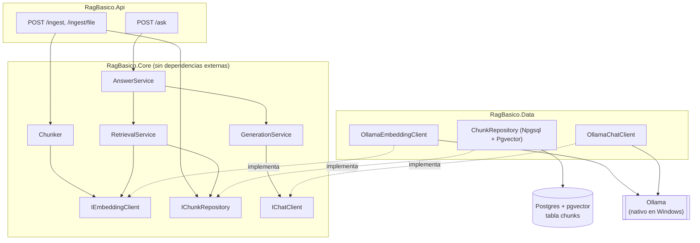

# RAG básico con .NET + pgvector

RAG (Retrieval-Augmented Generation) implementado a mano en .NET - sin LangChain, sin Semantic
Kernel, sin ningún framework que abstraiga chunking, embeddings, búsqueda vectorial o generación.
Es el primer proyecto de un portafolio de tres, pensado para mostrar la mecánica completa de un
pipeline RAG antes de compararla (proyecto 2) con lo que un framework de agentes resuelve por
vos.

## 1. Qué demuestra este proyecto

- Cómo partir un documento en chunks con una jerarquía de separadores (párrafo -> línea -> oración
  -> palabra -> corte duro), con overlap configurable entre chunks consecutivos.
- Cómo pedirle embeddings a un modelo local (Ollama) en batch, en vez de un request por chunk.
- Cómo guardar y buscar esos vectores en Postgres con la extensión `pgvector`, usando el operador
  de distancia coseno (`<=>`) directamente en SQL - sin ORM vectorial de por medio.
- Cómo armar un prompt con el contexto recuperado y pedirle una respuesta citada a un modelo de
  chat, también servido por Ollama.
- Una arquitectura en capas con una regla de dependencias explícita (`RagBasico.Core` sin
  paquetes externos) que después permite swapear infraestructura (ver
  [`docs/scaling.md`](docs/scaling.md)) sin tocar la lógica de negocio.

## 2. Arquitectura



Regla de dependencias: `Api -> Core`, `Api -> Data`, `Data -> Core`. `Core` nunca referencia
`Pgvector` ni ningún paquete HTTP/DB - por ejemplo, `IChunkRepository.SearchAsync` recibe
`float[]`, y la conversión a `Pgvector.Vector` ocurre únicamente dentro de
`RagBasico.Data.ChunkRepository`.

## 3. Stack y por qué

| Pieza | Elección | Por qué |
|---|---|---|
| Runtime | .NET 10, Minimal API | Sin capas de MVC/controllers que no aportan nada a un demo de 3 endpoints. |
| Vector DB | PostgreSQL + `pgvector` (`pgvector/pgvector:0.8.6-pg16`, Docker) | Una sola base para todo (sin vector DB separada), tag pinneado explícito. |
| Embeddings + generación | Ollama nativo en Windows (no Docker) | Containerizar Ollama en Docker Desktop/Windows pierde GPU salvo WSL2 + nvidia toolkit - complejidad innecesaria para un demo local. |
| Modelo de embeddings | `nomic-embed-text:latest`, 768 dims | Tag exacto - `nomic-embed-text-v2-moe` es un modelo distinto (dimensión variable), no intercambiable sin migrar el esquema. |
| Modelo de generación | `llama3.1:8b` | Corre razonablemente rápido en CPU/GPU local sin depender de una API paga. |
| Acceso a datos | Npgsql + `Pgvector` (0.3.2) | Tipo `vector` nativo de .NET, sin ORM de por medio. |

Detalle completo del porqué de cada decisión, con alternativas descartadas, en
[`docs/decisions.md`](docs/decisions.md).

## 4. Cómo correrlo

Prerrequisitos: Docker Desktop, .NET 10 SDK, Ollama instalado y corriendo en Windows con los
modelos `nomic-embed-text:latest` y `llama3.1:8b` descargados (`ollama pull <modelo>`).

```bash
# 1. Levantar Postgres + pgvector (único servicio en el compose)
docker-compose up -d

# 2. Health-check de Ollama - confirmar que el vector que devuelve tiene 768 dimensiones,
#    antes de tocar nada más (riesgo #1 del proyecto: mismatch de dimensión rompe el INSERT)
curl http://localhost:11434/api/embed -d '{"model":"nomic-embed-text:latest","input":"test"}'

# 3. Levantar la API (desde la raíz del repo, o abriendo RagBasico.slnx)
dotnet run --project src/RagBasico.Api
```

La app corre en `http://localhost:49808`. Requiere `ConnectionStrings:Postgres` en
`appsettings.Development.json` (gitignored, sin fallback) - ver `appsettings.json` para el resto
de la configuración (`ChunkSize`, `Overlap`, `BatchSize`, `TopK`, modelos de Ollama).

```bash
curl http://localhost:49808/health

curl -X POST http://localhost:49808/ingest/file \
  -H "Content-Type: application/json" \
  -d '{"fileName":"nota.md"}'

curl -X POST http://localhost:49808/ask \
  -H "Content-Type: application/json" \
  -d '{"question":"..."}'
```

`/ingest/file` resuelve `fileName` contra la carpeta `data/` del repo (ver limitaciones en la
sección 8).

## 5. Cómo funciona

**Ingesta (`POST /ingest` o `/ingest/file`):**
1. `Chunker.Split` parte el texto en chunks de hasta `ChunkSize` caracteres, con `Overlap`
   caracteres compartidos entre chunks consecutivos, probando una jerarquía de separadores
   (párrafo -> línea -> oración -> palabra -> corte duro por caracteres si nada más funciona).
2. `DocumentIngestionService` agrupa esos chunks en lotes de `BatchSize` y le pide los embeddings
   a Ollama (`POST /api/embed`) un lote a la vez, no un request por chunk.
3. Cada chunk + su embedding se guarda en la tabla `chunks` (`source`, `chunk_index`, `content`,
   `embedding`), con upsert por `(source, chunk_index)` si el documento ya existía.
4. Si la reingesta produjo menos chunks que la vez anterior, `DeleteOrphanedChunksAsync` borra los
   sobrantes para no dejar chunks huérfanos de una versión previa del documento.

**Pregunta (`POST /ask`):**
1. `RetrievalService` pide el embedding de la pregunta y busca los `TopK` chunks más cercanos por
   distancia coseno (`embedding <=> @queryEmbedding` en SQL, sin índice ANN - ver
   [`docs/scaling.md`](docs/scaling.md)).
2. `GenerationService` arma un prompt de dos mensajes: `system` con las reglas fijas (responder
   solo con el contexto dado, avisar si no alcanza, citar con `[source:chunk_index]`), y `user`
   con el contexto recuperado más la pregunta.
3. `OllamaChatClient` llama a `POST /api/chat` de Ollama y devuelve el texto generado.
4. La respuesta incluye `answer` (texto generado) y `citations` (la lista estructurada de chunks
   recuperados - no se parsean citas del texto libre del modelo, se confía en lo que
   efectivamente se le mandó como contexto).

## 6. Tests

```bash
dotnet test                                   # corre todo
dotnet test tests/RagBasico.Core.Tests        # solo chunking, sin Docker
dotnet test tests/RagBasico.Data.Tests        # retrieval, levanta un Postgres via Testcontainers
```

- **`RagBasico.Core.Tests`** (20 tests): `Chunker` - validaciones de parámetros, comportamiento
  básico, cada nivel de la jerarquía de separadores por separado, y el comportamiento del
  overlap.
- **`RagBasico.Data.Tests`** (5 tests): `ChunkRepository` contra un Postgres+pgvector real
  (Testcontainers, misma imagen que `docker-compose.yml`) - orden por distancia coseno, `topK`,
  upsert por `(source, chunk_index)`, y borrado de chunks huérfanos.

Detalle de por qué xUnit, por qué Testcontainers en vez de reusar el Postgres de desarrollo, y un
bug real de cache de tipos de Npgsql encontrado al escribir estos tests, en
[`docs/decisions.md`](docs/decisions.md) (Día 5).

## 7. Cómo escalar esto

Resumen - detalle completo en [`docs/scaling.md`](docs/scaling.md):

- Índice ANN (`hnsw` vs `ivfflat`) cuando el dataset deje de ser pequeño.
- El batching de embeddings ya está implementado (Día 2); el documento cubre el trade-off del
  tamaño de lote elegido.
- Cache de embeddings para no recalcular contenido sin cambios entre reingestas.
- `IEmbeddingClient`/`IChunkRepository` ya son la costura para swapear Ollama/Postgres por un
  proveedor hosted o un vector store dedicado, sin tocar `Core`.
- Hybrid search (full-text + vector) y reranking como mejoras de calidad de retrieval.
- Ingesta asíncrona (queue + worker), object storage en vez de filesystem local, y versionado de
  documentos como los cambios necesarios para un `/ingest` real en producción.

## 8. Fuera de alcance a propósito

Documentado con su razón en `docs/decisions.md`, resumido acá:

- **Sin índice ANN** - exact search alcanza al tamaño de dataset actual.
- **Ingesta síncrona y por filesystem local** (`/ingest/file` lee de `data/`) - no hay
  queue/worker ni object storage; asume un filesystem compartido que no existiría en producción.
- **Sin versionado de documentos** - cada reingesta recalcula todos los embeddings.
- **Credenciales de Postgres en claro** en `docker-compose.yml` - uso exclusivamente local.
- **Sin autenticación, rate limiting u observabilidad** en la API - son preocupaciones genéricas
  de cualquier API en producción, no específicas de RAG, y quedan fuera del objetivo pedagógico
  de este proyecto.
- **Sin capas de DI/abstracción "enterprise"** más allá de las interfaces que ya separan
  `Core` de `Data` - el proyecto es deliberadamente framework-free para mostrar la mecánica de
  RAG directamente.
